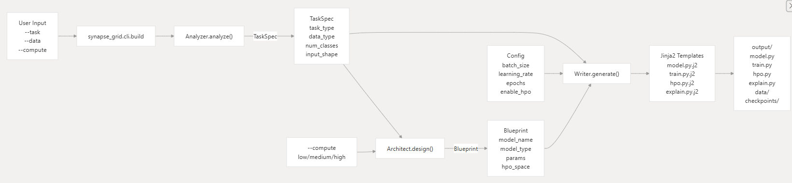
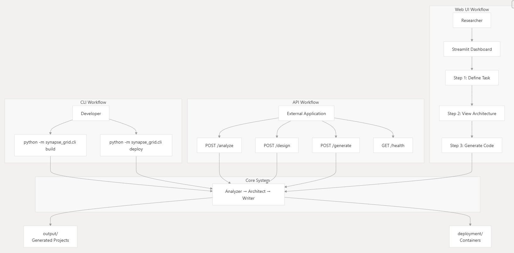
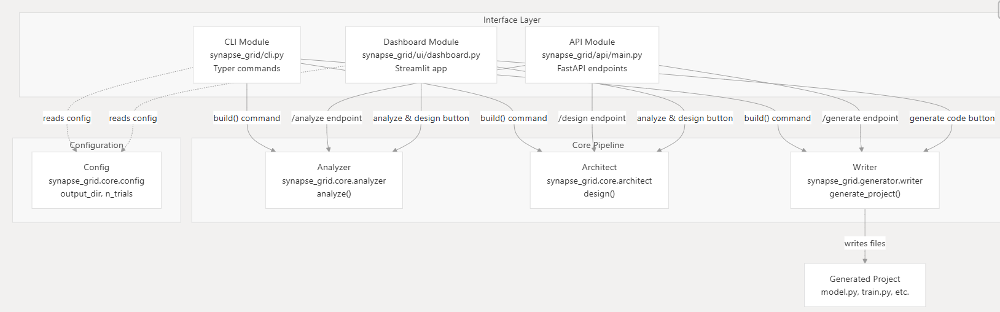
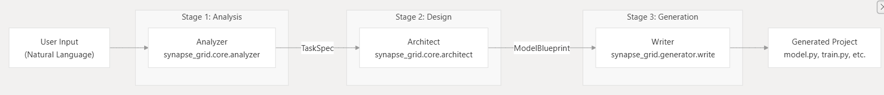

# SynapseGrid

**SynapseGrid** is an autonomous neural architect system designed to streamline the process of building, training, and explaining deep learning models. it acts as an AI-powered assistant that analyzes your task, designs the optimal neural architecture, and generates production-ready pytorch code

## features

- **intelligent analysis**: automatically analyzes task descriptions (e.g., "classify images", "predict housing prices") and data types to determine the best modeling approach

- **automated architecture design**: designs neural networks (CNNs, MLPs, transformers) tailored to your specific task and compute budget

- **code generation**: generates a complete, runnable pytorch project structure including:

    - `model.py`: the model definition

    - `train.py`: training loop with validation and logging

    - `hpo.py`: hyperparameter optimization scripts (using optuna)

    - `explain.py`: explainable AI (XAI) scripts using SHAP

- **explainable AI (XAI)**: built-in support for generating explanation scripts to understand model decisions (SHAP/GradCAM)

- **deployment ready**: tools to package and deploy trained models

## installation

1.  clone the repository:
    ```bash
    git clone https://github.com/Youcef3939/SynapseGrid.git 
    cd SynapseGrid
    ```

2.  install dependencies:
    ```bash
    pip install -r requirements.txt
    ```

## usage

SynapseGrid provides a powerful command line interface (CLI)

### 1. build a model
to generate a project for a specific task:

```bash
python -m synapse_grid.cli build --task "classify images of cats and dogs" --data ./data/cats_dogs --compute medium
```

**options:**
- `--task`: description of what you want to solve

- `--data`: path to your dataset

- `--compute`: compute budget (`low`, `medium`, `high`)

- `--hpo`: enable hyperparameter optimization (flag)

### 2. deploy a model
to prepare a trained model for deployment:

```bash
python -m synapse_grid.cli deploy --model-path ./output/checkpoints/model.pth
```

## generated project structure

when you run `build`, SynapseGrid creates a directory with:

```
output/
├── model.py       # the neural network architecture
├── train.py       # training script
├── explain.py     # XAI explanation script
├── hpo.py         # HPO script
├── data/          # data directory
└── checkpoints/   # model checkpoints
```

## dataflow


## interface architecture



## pipeline architecture


## running tests

to run the internal test suite:

```bash
pytest tests/
```

---

this project is designed for researchers, engineers, and teams who need fast, reliable neural architectures without spending hours tuning models by hand<3
